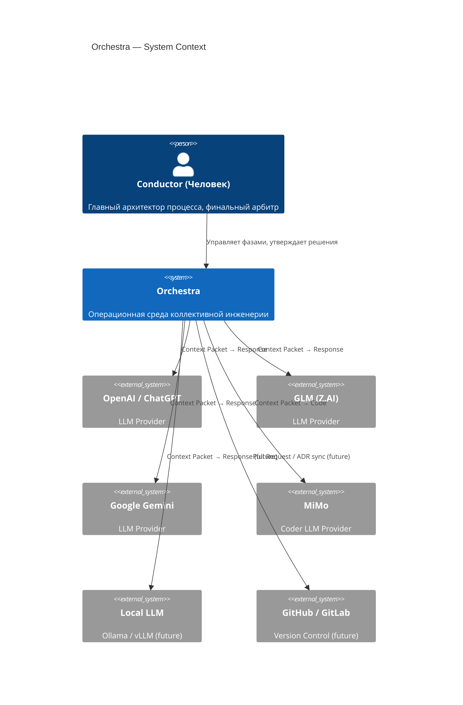
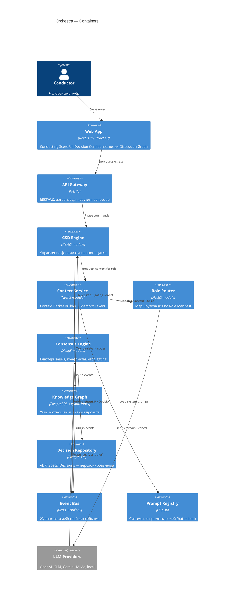
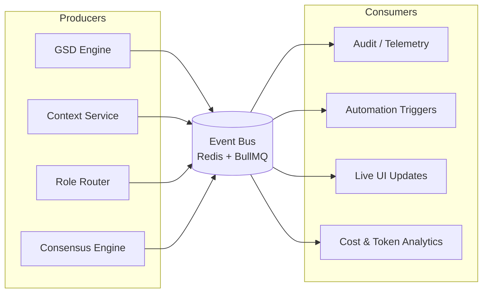
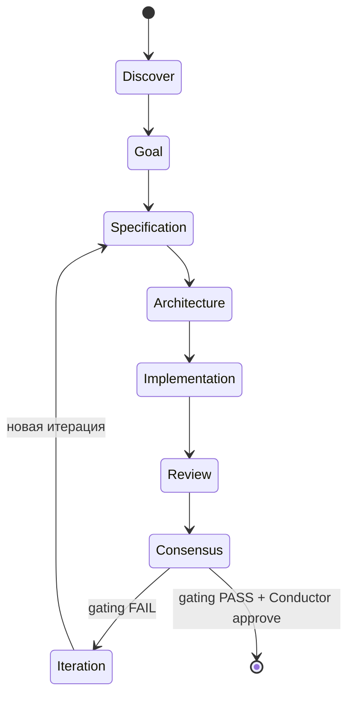

# Architecture

> Как устроено Orchestra. Этот документ отвечает на вопрос **«Как устроено?»**.
> Смежные: [Vision 2030.md](Vision%202030.md) («Зачем?»), [Orchestra_TC.md](Orchestra_TC.md) («Что реализовать?»).

Orchestra — расширяемая операционная среда для коллективной инженерной работы человека и специализированных ИИ-агентов. Это **не** мультичат и **не** оболочка над несколькими LLM. Главная единица работы — инженерное решение, проходящее фазовый жизненный цикл GSD.

Архитектура описана в нотации **C4** (Context → Container → Component) плюс потоковые диаграммы. Все межкомпонентные взаимодействия идут через **Event Bus**, а контекст агентам доставляет централизованный **Context Service**.

---

## 1. Архитектурные принципы

1. **GSD** — обязательный жизненный цикл каждой задачи (см. [GSD Integration.md](GSD%20Integration.md)).
2. **Все решения проходят через Consensus Engine** (см. [Consensus Protocol.md](Consensus%20Protocol.md)).
3. **Ни одна роль не может изменить решение другой роли напрямую** — только через новый артефакт.
4. **Все изменения фиксируются как отдельные артефакты** в Decision Repository.
5. **Каждое архитектурное решение имеет трассируемую историю** (Engineering Time Machine).
6. **Провайдеры LLM взаимозаменяемы** благодаря адаптерной модели (см. [Agent Protocol.md](Agent%20Protocol.md)).
7. **Расширение новыми ролями не требует изменения ядра** (Role Manifest — декларативный).
8. **Все обсуждения экспортируются** в воспроизводимые инженерные артефакты (ADR, Markdown, JSON).
9. **Прямой обмен полной историей сообщений между агентами запрещён** — только через Context Packet (см. [Context Protocol.md](Context%20Protocol.md)).

---

## 2. Уровень 1 — System Context

Внешние системы и пользователи, с которыми взаимодействует Orchestra.



**Ключевая идея**: человек (дирижёр) взаимодействует с Orchestra как с единой системой, а не с набором отдельных моделей. Orchestra сама маршрутизирует запросы, формирует контекст и собирает консенсус.

---

## 3. Уровень 2 — Containers

Основные автономные модули Orchestra. Каждый контейнер имеет собственное хранилище или подсистему и связан с другими через Event Bus.



### Контракты контейнеров

| Контейнер | Ответственность | Технология |
|---|---|---|
| **Web App** | Conducting Score UI, визуализация Discussion Graph, Decision Confidence gauges | Next.js 15, React 19, TypeScript, Tailwind, shadcn/ui, TanStack Query, Zustand |
| **API Gateway** | Рест/WS-эндпоинты, авторизация, координация модулей | NestJS |
| **GSD Engine** | Конечный автомат фаз (`Discover→Goal→Spec→Architecture→Implementation→Review→Consensus→Iteration`) | NestJS module |
| **Context Service** | Сборка Context Packet из Knowledge Graph + Memory Layers + Compression | NestJS module |
| **Role Router** | Диспетчеризация пакетов по Role Manifest; запрет прямого обмена между агентами | NestJS module |
| **Consensus Engine** | Семантическая кластеризация ответов, поиск конфликтов, итоговое решение, gating | NestJS module |
| **Knowledge Graph** | Граф знаний проекта: узлы + отношения | PostgreSQL + графовый индекс |
| **Decision Repository** | Версионированные инженерные артефакты | PostgreSQL |
| **Event Bus** | Асинхронная шина событий; единый журнал; точка расширения автоматизации | Redis + BullMQ |
| **Prompt Registry** | Хранение и hot-reload системных промптов ролей | FS / DB |

---

## 4. Уровень 3 — Component (ядро Orchestra)

Детализация взаимодействия внутри ядра при обработке одного раунда.

```text
                           ┌──────────────────────────────┐
                           │        USER (Дирижёр)        │
                           └──────────────┬───────────────┘
                                          │
                                          ▼
                           ┌──────────────────────────────┐
                           │      Session Manager         │
                           │  Управление проектами        │
                           │  Раундами и состоянием       │
                           └──────────────┬───────────────┘
                                          │
                                          ▼
                           ┌──────────────────────────────┐
                           │         GSD Engine           │
                           │ Управление фазами процесса   │
                           └──────────────┬───────────────┘
                                          │
            ┌─────────────────────────────┼─────────────────────────────┐
            ▼                             ▼                             ▼
┌─────────────────────┐      ┌─────────────────────┐      ┌─────────────────────┐
│ Knowledge Graph     │      │ Context Service     │      │ Prompt Registry     │
│ Знания проекта      │─────▶│ Context Packets     │◀────▶│ Системные промпты   │
└─────────────────────┘      └──────────┬──────────┘      └─────────────────────┘
                                        │
                                        ▼
                           ┌──────────────────────────────┐
                           │        Role Router           │
                           └──────────────┬───────────────┘
        ┌──────────────┬─────────────────┼─────────────────┬──────────────┐
        ▼              ▼                 ▼                 ▼              ▼
 ┌────────────┐ ┌────────────┐ ┌────────────┐ ┌────────────┐ ┌────────────┐
 │ ChatGPT    │ │ GLM        │ │ Gemini     │ │ Critic     │ │ MiMo       │
 │ Architect  │ │ Tech Lead  │ │ Research   │ │ Red Team   │ │ Coder      │
 └─────┬──────┘ └─────┬──────┘ └─────┬──────┘ └─────┬──────┘ └─────┬──────┘
       └──────────────┴──────────────┴──────────────┴──────────────┘
                                      │
                                      ▼
                         ┌──────────────────────────────┐
                         │      Consensus Engine        │
                         │ Анализ и итоговое решение    │
                         └──────────────┬───────────────┘
                                        │
                                        ▼
                         ┌──────────────────────────────┐
                         │      Decision Repository     │
                         │ ADR • Specs • Decisions      │
                         └──────────────────────────────┘
```

### Поток одного раунда

1. **Conductor** инициирует раунд через Web App → API Gateway.
2. **Session Manager** создаёт/возобновляет сессию, GSD Engine фиксирует текущую фазу.
3. **GSD Engine** запрашивает у Context Service пакет для каждой целевой роли.
4. **Context Service** опрашивает Knowledge Graph, накладывает контекстную политику роли, применяет Memory Layers и Compression, собирает Context Packet.
5. **Role Router** диспетчеризует пакеты провайдерам согласно Role Manifest (`/stream`, `/send`).
6. Провайдеры возвращают ответы (стриминг токенов).
7. **Consensus Engine** собирает ответы, кластеризует утверждения, находит противоречия, считает Decision Confidence, формирует итог.
8. **Decision Repository** сохраняет ADR / Decision / Consensus Report как версионированный артефакт.
9. **GSD Engine** получает gating-вердикт: либо переход фазы, либо доработка.
10. Все шаги 1–9 публикуют события на **Event Bus**.

---

## 5. Event Bus

Все действия системы оформляются как события. Event Bus — единственная асинхронная магистраль между контейнерами и единственная точка расширения автоматизации.



### Каталог событий

| Событие | Издатель | Назначение |
|---|---|---|
| `SessionCreated` | Session Manager | Создана новая сессия |
| `RoundStarted` | GSD Engine | Начат новый раунд |
| `PhaseChanged` | GSD Engine | Переход фазы GSD |
| `ContextPacketBuilt` | Context Service | Пакет собран (с хешем для воспроизводимости) |
| `PromptGenerated` | Prompt Registry | Применён системный промпт |
| `AgentInvoked` | Role Router | Запрос отправлен провайдеру |
| `AgentResponded` | Role Router | Получен полный ответ |
| `ConsensusGenerated` | Consensus Engine | Сформирован итог раунда |
| `DecisionAccepted` | Consensus Engine / Conductor | Решение утверждено |
| `ADRCreated` | Decision Repository | Создан ADR |
| `TaskCreated` / `TaskCompleted` | GSD Engine | Задача в фазе Implementation |
| `ConfidenceRecalculated` | Consensus Engine | Continuous Consensus пересчёт |

**Свойства шины**: идемпотентность по `event_id`, упорядоченность внутри сессии, durability (Redis AOF), журнал без удаления (аудиторский след). Подключение нового потребителя (аналитика, нотификации, автономные сессии) не требует изменения ядра.

---

## 6. Knowledge Graph

Внутренний граф знаний проекта. Context Service извлекает из него только релевантные узлы — полная история никогда не передаётся агентам напрямую.

### Типы узлов

```
Goals · Requirements · Architecture · API · Modules · Entities
Repositories · Services · Risks · Tests · ADR · Tasks
Research · Code · Documentation · Decision
```

### Типы отношений

```
depends_on · replaces · implements · validates · blocks
supersedes · conflicts_with · references
```

Полный контракт узла, индексы и алгоритм извлечения релевантного подграфа — в [Context Protocol.md §Knowledge Graph](Context%20Protocol.md#4-knowledge-graph).

---

## 7. Discussion Graph

Обсуждение — это граф параллельных веток, а не линейный чат. Каждая ветка имеет собственный контекст, исследования, риски, Consensus и артефакты.

```text
                Выбор БД
                     │
      ┌──────────────┼──────────────┐
      │              │              │
 PostgreSQL      MongoDB      EventStore
      │              │              │
      └──────────────┼──────────────┘
                     │
             Consensus Engine
                     │
                     ▼
            Architecture Decision
```

Discussion Graph управляется **Discussion Branch Engine** (см. [Orchestra_TC.md §Discussion Branch Engine](Orchestra_TC.md)). Архитектурно это подсистема Context Service: ветка = отдельное подмножество Knowledge Graph с изолированным Consensus. Merge ветки в main graph происходит только после утверждения дирижёром.

---

## 8. Memory Layers

Контекст разделяется на пять уровней с убыванием приоритета при компрессии. Полная семантика, приоритеты сохранения и правила сброса — в [Context Protocol.md §Memory Layers](Context%20Protocol.md#3-memory-layers).

| Layer | Имя | Назначение | Жизненный цикл |
|---|---|---|---|
| 1 | System Memory | Инварианты проекта | Не изменяется |
| 2 | Project Memory | Архитектура проекта | Стабильна |
| 3 | Working Memory | Текущая задача | На время задачи |
| 4 | Conversation Memory | Последние сообщения | Скользящее окно |
| 5 | Scratch Memory | Временные вычисления | Сброс после раунда |

---

## 9. Жизненный цикл GSD как системный flow



Переход фазы **невозможен**, пока Decision Confidence не пройдёт порог gating (см. [Consensus Protocol.md §Gating](Consensus%20Protocol.md#6-gating-по-фазам-gsd)) и пока человек не подтвердит переход.

---

## 10. Технологический стек

| Слой | Технологии |
|---|---|
| Frontend | Next.js 15, React 19, TypeScript, Tailwind CSS, shadcn/ui, TanStack Query, Zustand |
| Backend | NestJS, TypeScript |
| Storage | PostgreSQL (Knowledge Graph, Decision Repository), Prisma |
| Bus | Redis, BullMQ |
| Observability | Langfuse (LLM trace), OpenTelemetry |
| Runtime | Docker, Docker Compose |

---

## 11. Расширяемость

- **Новая роль** — декларативный Role Manifest (см. [Agent Protocol.md](Agent%20Protocol.md)), без изменения ядра.
- **Новый провайдер LLM** — реализация контракта `AIProvider` (см. [Agent Protocol.md §AI Provider SDK](Agent%20Protocol.md#7-ai-provider-sdk)), включая локальные модели.
- **Новая стратегия Consensus** — плагин типа `Consensus Strategy`.
- **Новый источник знаний** — плагин `Knowledge Extractor`.
- **Автоматизация** — подписка на события Event Bus, без правки контейнеров.

Полный каталог плагинов и контракт `Plugin` — в [Agent Protocol.md §Plugin SDK](Agent%20Protocol.md#8-plugin-sdk).

---

## 12. Главный архитектурный принцип

Orchestra — это не мультичат и не оболочка над несколькими LLM. Это платформа управления инженерным мышлением, где:

- **GSD** определяет жизненный цикл разработки;
- **Knowledge Graph** хранит знания проекта;
- **Context Service** доставляет каждой роли только необходимую информацию;
- **Role Router** обеспечивает независимость агентов;
- **Consensus Engine** превращает экспертную дискуссию в формализованные инженерные решения;
- **Decision Repository** сохраняет результаты в виде воспроизводимых артефактов.

Система проектируется как расширяемая операционная среда для коллективной работы человека и специализированных ИИ-агентов, а не как очередной интерфейс для общения с моделями.
