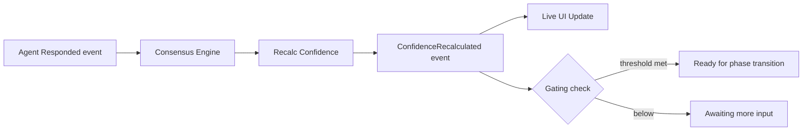
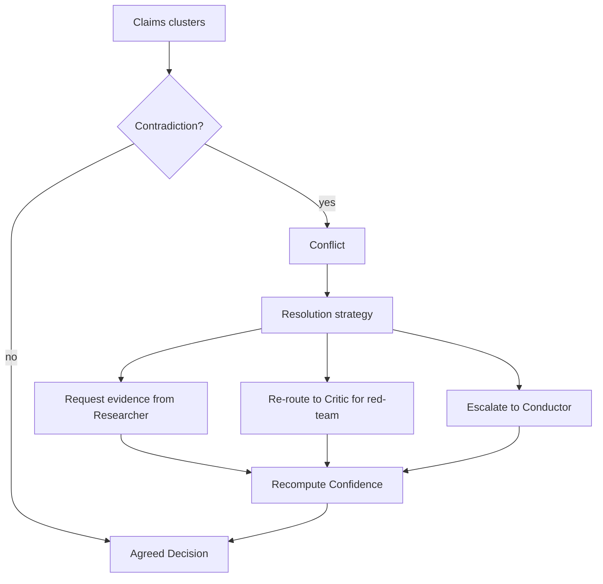

# Consensus Protocol

> Как Discussion превращается в формализованное инженерное решение: алгоритм, метрики Decision Confidence, gating по фазам GSD.
> Смежные: [Architecture.md](Architecture.md) (Consensus Engine как контейнер), [Context Protocol.md](Context%20Protocol.md), [GSD Integration.md](GSD%20Integration.md).

Consensus Engine — не LLM. Это отдельный детерминированный модуль приложения. Он собирает ответы всех ролей, выявляет согласованные решения, фиксирует разногласия, формирует итог и определяет следующий шаг GSD.

---

## 1. Контракт результата

```typescript
interface ConsensusReport {
  id: string;
  roundId: string;
  summary: string;

  agreedDecisions: Decision[];          // согласованные утверждения
  disagreements: Conflict[];            // противоречия между ролями
  openQuestions: Question[];            // вопросы, оставшиеся нерешёнными
  risks: Risk[];                        // выявленные риски
  nextAction: GSDAction;                // предлагаемый следующий шаг

  confidence: DecisionConfidence;       // см. §5
  gatingVerdict: 'pass' | 'fail';       // см. §6
}

interface Decision {
  id: string;
  title: string;
  description: string;
  status: 'proposed' | 'accepted' | 'rejected';
  acceptedBy: RoleRef[];
  rejectedBy: RoleRef[];
}
```

---

## 2. Алгоритм

```text
Получить ответы всех ролей
        │
        ▼
Разбить на утверждения (atomic claims)
        │
        ▼
Семантическая кластеризация
        │
        ▼
Найти совпадения  ──► Agreed Decisions
        │
        ▼
Найти противоречия  ──► Disagreements
        │
        ▼
Оценка уверенности каждого кластера
        │
        ▼
Определить уровень согласия
        │
        ▼
Сформировать итоговое решение
        │
        ▼
Генерация ADR (если фаза Architecture)
        │
        ▼
Определить следующий шаг GSD
```

---

## 3. Этапы протокола

Consensus Engine работает по фиксированной последовательности из 9 этапов.

| # | Этап | Вход | Выход |
|---|---|---|---|
| 1 | **Сбор ответов** | responses: `Record<RoleRef, string>` | Полный корпус раунда |
| 2 | **Выделение утверждений** | Корпус | atomic claims с ролями-авторами |
| 3 | **Семантическая кластеризация** | claims | Кластеры тематически близких утверждений |
| 4 | **Поиск противоречий** | кластеры | `conflicts_with`-отношения (сигналы расхождения) |
| 5 | **Оценка уверенности** | кластеры + метаданные | `DecisionConfidence` по кластеру |
| 6 | **Уровень согласия** | распределение голосов | % согласия / воздержавшихся / против |
| 7 | **Формирование итога** | agreed + disputed | `ConsensusReport.summary` |
| 8 | **Генерация ADR** | accepted decisions | ADR-артефакт в Decision Repository |
| 9 | **Следующий шаг GSD** | gating verdict | переход фазы или итерация |

---

## 4. Continuous Consensus

Consensus не формируется разово в конце раунда. Он **пересчитывается постоянно** — после каждого ответа любой роли.

После каждого ответа пересчитываются:

- уровень согласия;
- уровень риска;
- количество противоречий;
- недостающие исследования;
- вероятность успеха решения.

Таким образом дирижёр в любой момент видит состояние проекта на Conducting Score (см. [UI Canon.md §Conducting Score](UI%20Canon.md)).



---

## 5. Decision Confidence

Каждое решение (и каждый Consensus Report) получает набор оценок в процентах. Это формализованная замена «кажется, согласовано».

### Метрики

| Метрика | Что измеряет | Источник данных |
|---|---|---|
| **Architecture Confidence** | Согласованность архитектурных утверждений между Architect/Tech Lead/Critic | кластеры архитектурных claims |
| **Implementation Confidence** | Готовность к реализации (спецификация полна, стек определён) | claims в фазе Specification/Implementation |
| **Research Coverage** | Доля гипотез, подкреплённых исследованиями Gemini | claims, помеченные как research-backed |
| **Risk Coverage** | Доля выявленных рисков, для которых есть митигация | risks с `mitigation`-узлом в Knowledge Graph |
| **Test Coverage** | Доля требований с связанными тестами | `validates`-отношения в графе |

### Пример

```
Architecture Confidence   94 %
Implementation Confidence 88 %
Research Coverage         92 %
Risk Coverage             79 %
Test Coverage             64 %
```

### Принцип вычисления

Каждая метрика — это отношение «покрытых» утверждений к «требуемым» в рамках фазы, взвешенное по уровню согласия ролей. Точная формула и веса — настраиваемая политика Consensus Engine (плагин `Consensus Strategy`).

```typescript
interface DecisionConfidence {
  architecture: number;   // 0..100
  implementation: number;
  researchCoverage: number;
  riskCoverage: number;
  testCoverage: number;
  overall: number;        // взвешенное среднее
}
```

---

## 6. Gating по фазам GSD

Если показатель Confidence ниже допустимого порога для текущей фазы, **система запрещает переход к следующей фазе GSD**. Gating — жёсткий, без обхода (кроме явного owner-override дирижёра с записью в аудит).

### Пороговые значения (MVP, настраиваемо)

| Фаза GSD | Ключевая метрика | Минимальный порог для перехода |
|---|---|---|
| Goal → Specification | Architecture Confidence | 70 % |
| Specification → Architecture | Research Coverage | 75 % |
| Architecture → Implementation | Architecture Confidence | 85 % |
| Implementation → Review | Implementation Confidence | 80 % |
| Review → Consensus | Risk Coverage | 70 % |
| Consensus → exit / Iteration | overall | 80 % |

Gating-вердикт: `pass` если все применимые метики ≥ порога, иначе `fail` → итерация с явным списком пробелов (недостающие исследования, непокрытые риски).

---

## 7. Конфликт-резолюция



Стратегии разрешения конфликта:
- **Request evidence** — Gemini проводит дополнительное исследование.
- **Re-route to Critic** — Critic анализирует обе позиции независимо.
- **Escalate to Conductor** — человек-дирижёр принимает решение (Human Governance, см. [GSD Integration.md](GSD%20Integration.md)).

---

## 8. Главный принцип

Consensus Engine превращает экспертную дискуссию в **формализованные инженерные решения**. Это не голосование и не «мнение большинства» — это детерминированный протокол с измеримым уровнем уверенности и жёстким gating, гарантирующим, что ни одно решение не проходит дальше без достаточного покрытия исследованиями, рисками и тестами.
