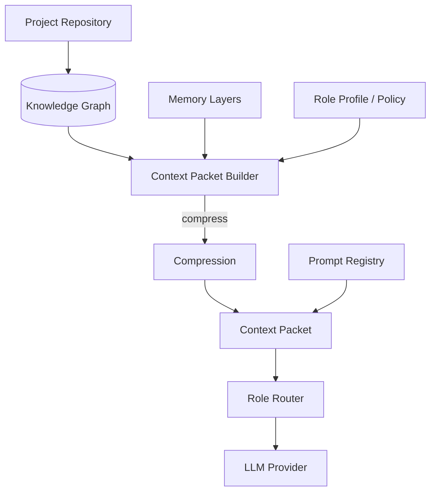
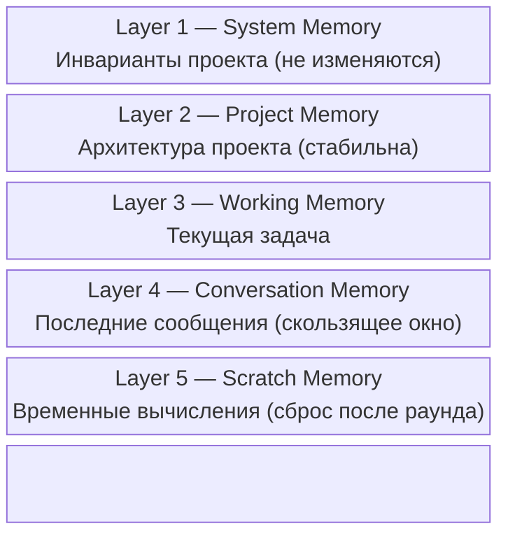

# Context Protocol

> Контракт контекста в Orchestra: как формируется, компрессируется и доставляется информация каждой роли.
> Смежные: [Architecture.md](Architecture.md), [Agent Protocol.md](Agent%20Protocol.md), [Consensus Protocol.md](Consensus%20Protocol.md).

Ни один агент **никогда** не получает полную историю проекта. Перед каждым запросом Context Service формирует специализированный **Context Packet**, содержащий только ту информацию, которая необходима конкретной роли для решения текущей задачи.

Это позволяет:

- значительно сократить потребление токенов;
- исключить *context rot* (деградацию качества из-за длинного контекста);
- уменьшить вероятность ухода модели в сторону;
- обеспечить воспроизводимость ответов;
- масштабировать проекты до десятков тысяч сообщений.

**Главный инвариант**: прямой обмен полной историей сообщений между агентами **запрещён**. Все взаимодействия — только через Context Packet.

---

## 1. Архитектура Context Service



Pipeline: **Knowledge Graph → Builder → (Memory Layers overlay) → Compression → Packet → Role Router → Provider**.

---

## 2. Контракт ContextPacket

```typescript
interface ContextPacket {
  // Идентификация
  sessionId: string;
  projectId: string;
  roundId: string;
  phase: GSDPhase;                       // Discover | Goal | Specification | ...

  // Роль-адресат
  role: RoleRef;                         // id, displayName, responsibilities

  // Содержимое (собрано из Knowledge Graph по политике роли)
  objective: string;                     // текущая цель раунда
  relevantDecisions: DecisionRef[];      // ADR / Decision, влияющие на задачу
  openQuestions: QuestionRef[];
  knownRisks: RiskRef[];
  constraints: Constraint[];
  artifacts: ArtifactRef[];              // спецификации, код, исследования
  conversationSummary: Summary;          // агрегированная сводка, не сырые сообщения

  // Промпт и формат
  systemPrompt: string;                  // из Prompt Registry
  expectedOutput: OutputSpec;            // тип ожидаемого артефакта
  outputFormat: 'json' | 'markdown' | 'code' | 'adr';

  // Метаданные воспроизводимости
  builtAt: ISO8601;
  modelTarget: string;                   // целевая модель
  contextPolicyId: string;               // версия политики
  contentHash: string;                   // sha256 сериализованного пакета
}

type GSDPhase =
  | 'Discover' | 'Goal' | 'Specification' | 'Architecture'
  | 'Implementation' | 'Review' | 'Consensus' | 'Iteration';
```

### Структура пакета (YAML-проекция)

```yaml
Session:
  id:
  project:
  round:
  phase:

Role:
  name:
  responsibilities:

Current Objective:

Relevant Decisions:

Open Questions:

Known Risks:

Constraints:

Artifacts:

Conversation Summary:

Expected Output:

Output Format:
```

---

## 3. Memory Layers

Контекст разделяется на пять уровней. Уровни упорядочены по приоритету сохранения при компрессии: Layer 1 **никогда** не отбрасывается, Layer 5 сбрасывается первым.



| Layer | Имя | Содержимое | Жизненный цикл | Приоритет компрессии |
|---|---|---|---|---|
| 1 | **System Memory** | Инварианты проекта, принципы, соглашения | Не изменяется | 1 (высший — не отбрасывается) |
| 2 | **Project Memory** | Архитектура, стек, ключевые ADR | Стабильна, версионно | 2 |
| 3 | **Working Memory** | Контекст текущей задачи / фазы GSD | На время задачи | 3 |
| 4 | **Conversation Memory** | Последние сообщения текущей сессии | Скользящее окно (N раундов) | 4 |
| 5 | **Scratch Memory** | Промежуточные вычисления, черновики | Сброс после раунда | 5 (первый кандидат на сброс) |

Memory Layers — это **overlay** над Knowledge Graph, а не отдельное хранилище: Builder выбирает узлы графа, а затем распределяет их по слоям согласно типу узла и временной зоне (System/Project — медленно меняющиеся, Working/Conversation — активные, Scratch — эфемерные).

---

## 4. Knowledge Graph

Вместо передачи всей истории система строит внутренний граф знаний проекта. Builder извлекает из него только релевантные узлы для конкретной роли.

### Типы узлов

```
Goals · Requirements · Architecture · API · Modules · Entities
Repositories · Services · Risks · Tests · ADR · Tasks
Research · Code · Documentation · Decision
```

### Типы отношений

| Отношение | Семантика |
|---|---|
| `depends_on` | Узел A требует B |
| `replaces` | A заменяет B (версионирование) |
| `implements` | A реализует требование B |
| `validates` | A проверяет B (тест → код) |
| `blocks` | A блокирует B |
| `supersedes` | A превосходит/наследует B |
| `conflicts_with` | A противоречит B (сигнал для Consensus) |
| `references` | A ссылается на B (нейтрально) |

### Алгоритм извлечения подграфа

1. Старт от узла «Текущая цель» (objective).
2. Расширение по отношениям `depends_on`, `implements`, `references` на глубину `k` (роль-специфичная).
3. Включение узлов, помеченных `conflicts_with` для роли Critic.
4. Применение контекстной политики роли (include/exclude — см. §5).
5. Токен-бюджетный отсев по приоритету Memory Layers.

---

## 5. Контекстные политики

Для каждой роли определяется собственная политика формирования контекста. Политики полностью настраиваемые и версионированные.

```yaml
role: ChatGPT

max_tokens: 32000

include:
  - ADR
  - Requirements
  - Architecture
  - Risks
  - Decisions

exclude:
  - Code Diff
  - Build Logs
  - CI Output
```

### Правила формирования по ролям

#### ChatGPT (Chief Architect)
**Получает**: цели проекта; архитектурные решения; ADR; ограничения; спорные вопросы; системные инварианты.
**Не получает**: длинные журналы реализации; мелкие исправления кода; технический шум.

#### GLM (Tech Lead)
**Получает**: архитектурное решение; требования; стек; API; модели данных; производственные ограничения.
**Не получает**: обсуждения стратегии; маркетинговые вопросы; не относящиеся к реализации дискуссии.

#### Gemini (Researcher)
**Получает**: исследовательский вопрос; существующие варианты; критерии оценки; ограничения.
**Не получает**: детали реализации, не влияющие на исследование.

#### Critic (Red Team)
**Получает**: предлагаемое решение; инварианты; требования; критерии качества.
**Не получает** предыдущие замечания других критиков — чтобы сохранять независимость анализа.

#### MiMo (Senior Software Engineer)
**Получает**: утверждённую архитектуру; техническую спецификацию; необходимые файлы проекта; стиль кодирования; критерии приёмки.
**Не получает** незавершённые архитектурные дискуссии.

---

## 6. Context Compression

Если объём информации превышает лимит контекста модели, применяется многоуровневая компрессия.

**Приоритет сохранения информации** (по убыванию — что отбрасывается последним):

1. Инварианты проекта (Layer 1)
2. Требования
3. Архитектурные решения (ADR)
4. Активные задачи
5. Открытые вопросы
6. Риски
7. Недавние изменения (Layer 4)
8. История обсуждений (Layer 4, младшие раунды)

**Правило**: история сообщений никогда не передаётся напрямую, если её можно заменить структурированным артефактом (сводкой, ADR, спецификацией). Сводка сохраняет семантику; сырой лог — нет.

### Стратегии компрессии

| Стратегия | Когда применяется |
|---|---|
| **Summarize** | Layer 4 за пределами скользящего окна → агрегированная сводка |
| **Drop** | Layer 5 Scratch после завершения раунда |
| **Reference** | Полный артефакт заменяется ссылкой (`DecisionRef`) |
| **Dereference on demand** | Роль может запросить полный узел через Role Router, если сводки недостаточно |

---

## 7. Воспроизводимость

Каждый Context Packet сохраняется вместе с:

- временем формирования (`builtAt`);
- используемой моделью (`modelTarget`);
- версией системного промпта (из Prompt Registry);
- версией проекта (snapshot Knowledge Graph);
- хешем содержимого пакета (`contentHash`).

Это позволяет в любой момент повторно выполнить тот же запрос и получить максимально воспроизводимый результат — основа **Engineering Time Machine** (см. [Vision 2030.md](Vision%202030.md)).

```typescript
interface ContextPacketRecord {
  packet: ContextPacket;
  kgSnapshotRef: string;        // версия Knowledge Graph на момент сборки
  promptVersion: string;        // версия системного промпта
  replayable: true;             // гарантия воспроизводимости
}
```

---

## 8. Архитектурный принцип

Context Service является центральным компонентом Orchestra. Все взаимодействия между ролями выполняются **исключительно через него**. Прямой обмен полной историей сообщений между агентами запрещён.

Таким образом система работает не как чат нескольких LLM, а как управляемая инженерная среда с фазовым управлением контекстом в соответствии с методологией GSD (см. [GSD Integration.md](GSD%20Integration.md)).
